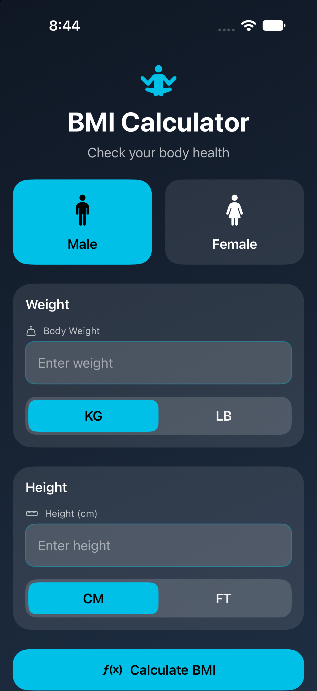

# 🧮 BMI Calculator

A simple and modern **BMI Calculator iOS application** built using **Swift and SwiftUI**.

The app allows users to enter their weight and height, select their preferred units, and calculate their BMI with a clear result and health category.

## 📱 Screenshots

### Home Screen

  

### BMI Result

  

## ✨ Features

- 👤 Male/Female selection
- ⚖️ Weight input with KG/LB units
- 📏 Height input with CM/FT units
- 🧮 BMI calculation
- 📊 BMI category/result display
- 🎨 Clean and modern SwiftUI interface

## 🛠️ Built With

- Swift
- SwiftUI
- Xcode
- iOS

## 👨‍💻 Author

**Sumit Tak**

[LinkedIn](https://www.linkedin.com/in/sumit-tak-9049092b5/) • [GitHub](https://github.com/Byte-Mastering-Hub)
